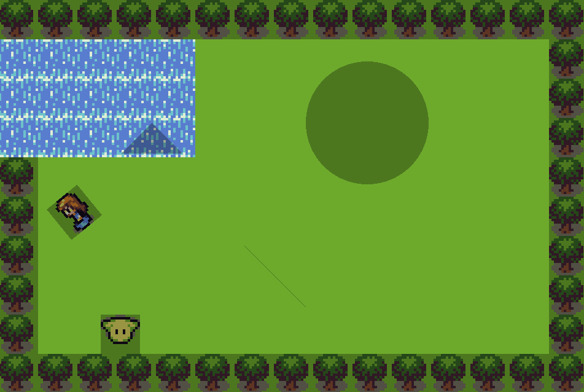

# game-framework

A 2D game framework that is capable of basic rendering, physics, and sound.

## How to install and build this project:
    git clone --recursive https://github.com/NoahR02/game-framework.git
    